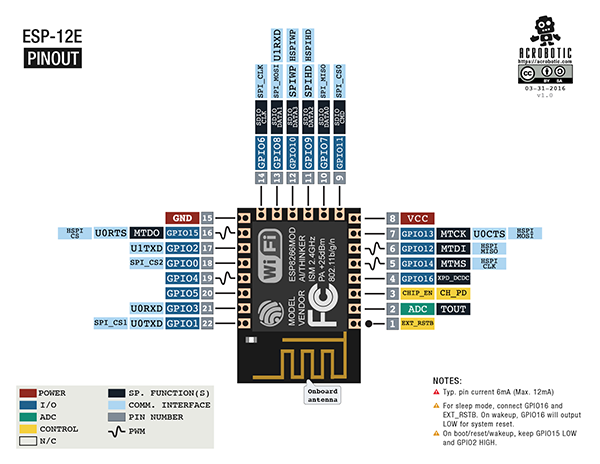
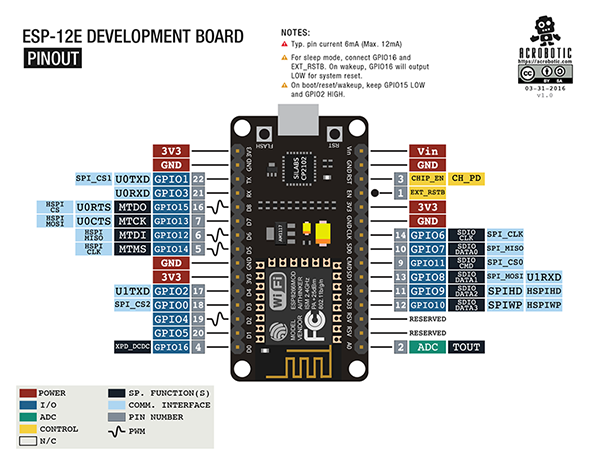
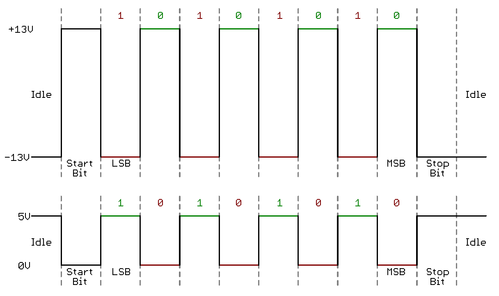
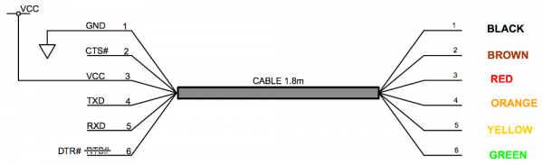

# Clear and Flash Firmware onto ESP8266 and Connect to Wifi

### Spec:
Chip Family:
  * ESP8266

Chip:
  * ESP-12E (12F)

Memory:
  * 4MB SPI flash storage

Power:
  * 3.3V 500mA voltage regulator (LM1117)

Extensions:
  * micro USB to Serial UART Adapter
  * 30 pin breakout
  * physical reset and flash buttons

### ESP-12E Pin Schematic:
Chip:

Board:


### All commands run within the scope of the directory
Before beginning, ensure there are no processes currently hogging TTY resources
```
ESP8266 :> ps aux | grep tty
lowellmower     68805   0.0  0.0  2460716     76 .SLA  Ss+   1:13PM   0:00.02 SCREEN /dev/tty.SLAB_USBtoUART 115200
```
In the case above `SCREEN` is running on port `68805` so we'll want to `kill` that:
```
sudo kill -9 68805
```

1.) Clear the ESP8266
```
ESP8266 :> python esptool/esptool.py --port /dev/tty.SLAB_USBtoUART erase_flash
```
The above command should result in out put like:
```
esptool.py v2.0-beta2
Connecting........
Detecting chip type... ESP8266
Uploading stub...
Running stub...
Stub running...
Erasing flash (this may take a while)...
Chip erase completed successfully in 9.1s
Hard resetting...
```
2.) Flash the firmware onto the ESP8266
I've `cd`'d into the `espruino_1v91_esp8266` directory where the binary `boot_v1.6.bin` lives and prepended my python commands to go up a directory. One could just as easily move the binary into your `$PATH` or to the same location as the python commands
```
espruino_1v91_esp8266 :> python ../esptool/esptool.py  \
--port /dev/tty.SLAB_USBtoUART                         \
--baud 115200 write_flash                              \
--flash_freq 80m                                       \
--flash_mode qio                                       \
--flash_size 4MB                                       \
0x0000 'boot_v1.6.bin' 0x1000 espruino_esp8266_user1.bin 0x3FC000 esp_init_data_default.bin 0x3FE000 blank.bin
```

3.) `screen` to open HMI with the ESP8266
`screen /dev/tty.SLAB_USBtoUART 115200`
The above command should result in a new interface, where a call to the function `reset()` should produce something similar to the following:
```
>reset()
=undefined

 _____                 _
|   __|___ ___ ___ _ _|_|___ ___
|   __|_ -| . |  _| | | |   | . |
|_____|___|  _|_| |___|_|_|_|___|
          |_| http://espruino.com
 1v91 Copyright 2016 G.Williams

Espruino is Open Source. Our work is supported
only by sales of official boards and donations:
http://espruino.com/Donate
Flash map 4MB:512/512, manuf 0xe0 chip 0x4016

>
```
4.) Connect to wifi
```
# CREATE VAR OF CLASS
>var wifi = require("Wifi");
=function () { [native code] }

# PASS CONNECTION INFO AND BASIC FEEDBACK
>wifi.connect("burgercats-2.4GHz",
              {password: "********"},
              function(err){
                if(err)console.log(err);
                else console.log("Connected!");
                })
=undefined

# IN A NUMBER OF SECONDS RECIEVE FEEDBACK
"Connected!"

# CHECK STATUS
>wifi.getStatus();
={
  "mode": "sta+ap",
  "station": "connected",
  "ap": "enabled",
  "phy": "11n",
  "powersave": "ps-poll",
  "savedMode": "off"
 }
>wifi.getIP();
={
  "ip": "10.0.0.88",
  "netmask": "255.255.255.0",
  "gw": "10.0.0.1",
  "mac": "a0:20:a6:13:53:56"
 }
>
```

### Helpful Links:
- [espruino.com](http://www.espruino.com/ESP8266_Flashing) general info on flashing JS
- [nodelua](https://nodelua.org/) flashing lua (about 100x smaller than JS)
- [esptool](https://github.com/espressif/esptool) in python
- [USB to UART Bridge VCP Drivers](https://www.silabs.com/products/development-tools/software/usb-to-uart-bridge-vcp-drivers) from Silicon Labs
- [ESP8266 Community Forum](http://www.esp8266.com/)
- [ESP Easy](https://www.letscontrolit.com/wiki/index.php/ESPEasy)
- [Tasmota](https://github.com/arendst/Sonoff-Tasmota)

### Vernacular and Understandings
- UART (universally asynchronous receiver/transmitter)
- TTL (transistor-transistor logic)
- OV (typically 3.3v, or low, or 0 - with respect to TTL)
- VCC (typically 5v, or high, or 1 - with respect to TTL)
- RS-232 (recommended standard 232, 9 pin serial port, think monitor)^*


* By the RS-232 standard a logic high ('1') is represented by a negative voltage
anywhere from -3 to -25V – while a logic low ('0') transmits a positive voltage
that can be anywhere from +3 to +25V. On most PCs these signals swing from -13 to
+13V. The more nuanced voltage structure of `RS-232` allows for more reliable data
communication over longer distances in comparison its `TTL` counter part.


above is an example of the communication differences between `RS-232` and `TTL`
sending the signal `0(b)01010101` where `0(b)` is the starting bit

When communicating directly to pin headers, the headers map to the serial cable
typically over six pins; `RX(I/O)`, `TX(I/O)`, `GND`, `DTR`, `VCC`x2 (3v3 or 5v)
